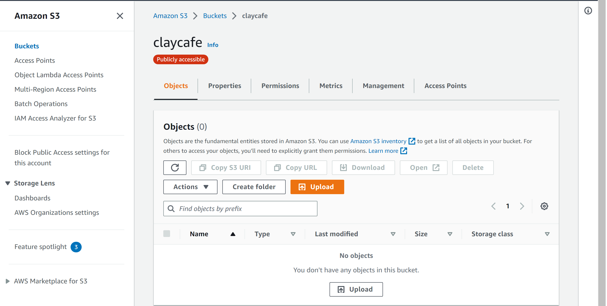
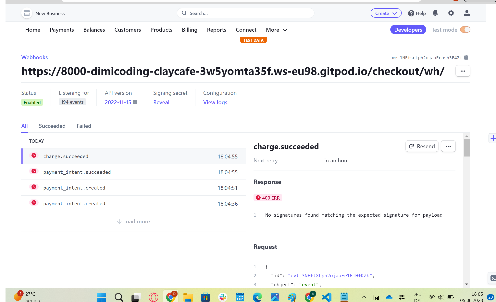

<h1 align="center"><strong>CLAY</strong>CAFE</h1>

Welcome to Clay Cafe. We are an ecommerce business specializing in handmade clay products that are as beautiful as they are unique. Explore our collection of vases, cups, plates & bowls, and discover the magic of clay artistry.

But we offer more than just products. Dive into our blog, where we share pottery tips, techniques, and inspiration. Join our on-site workshops to get hands-on experience and learn from skilled artisans and while you're here, don't forget to have a sip of our tasty roasted coffee and snacks for a complete sensory experience.

At Clay Cafe, we're passionate about fostering creativity and providing a space for art enthusiasts to connect. Join us on this clay-filled journey and uncover the wonders of handmade art at Clay Cafe.

 

**[Go to the Website](https://claycafe.herokuapp.com/)**

 

**Disclaimer:** This E-Commerce store has been created solely for educational purposes. All images used in this store are sourced from free services such as Pexels and Unsplash. Please note that the products and images showcased on this platform are not available for purchase. This project doesn't have a physical cafe, the address and workshop location mentioned in this project belong to a local pottery workshop located in Cologne, Germany.

 

### Table of Contents

- [UX](#ux)
    - [Target Audience](#target-audience)
    - [Website owner business goals](#website-owner-business-goals)
    - [User Experience](#user-experience)
        - [User Stories](#)
    - [Design](#design)
        - [Colours](#colours)
        - [Fonts](#fonts)
        - [Images](#images)
        - [Wireframes](#wireframes)
        - [Database](#database)
- [Agile](#target-audience)
- [SEO and Marketing](#seo-and-marketing)
- [Features](#features)
    - [Navigation Bar](#navigation-bar)
    - [Footer](#footer)
    - [Home Page](#home-page)
    - [Shop](#all-products)
    - [Category](#category)
    - [Workshops](#workshops)
    - [Blog](#blog)
    - [Contact](#contact-form)
    - [Profile](#profile)
    - [Bag](#bag)
    - [Checkout](#checkout)
- [Features Left to Implement](#features-left-to-implement)
- [Testing](#testing)
- [Fixed Bugs](#fixed-bugs)
- [Deployment](#deployment)
- [Credits](#credits)
- [Acknowledgments](#acknowledgements)

# UX
## Target Audience
- Pottery enthusiasts of all ages and skill levels
- Individuals looking for unique and handcrafted pottery items
- Art and craft lovers seeking a creative outlet
- People interested in learning pottery through workshops
- Blog readers interested in pottery-related articles, tips, and inspiration
## Website owner business goals
- Offer a diverse range of high-quality pottery products
- Make the buying process easy and secure
- Newsletter, targeted email marketing and special offers
- Make workshop information clear and appealing
- Create a professional and attractive website design
- Engage with customers through social media
- Engage with customers through the blog

## User Experience

### User Stories

###	EPIC: Customer Stories, general view and navigation:

1.	As a customer, I want a website with a clean and intuitive navbar to easily navigate and find the information I need quickly and efficiently.

2.	As a customer, I want to see a list of products so I can choose which ones to buy.

3.	As a customer, I want to scroll down the homepage to have a quick overview of the website’s content.

4.	As a customer, I want to see details about each product, like the price, description, and image.

5.	As a customer, I want to easily see the total amount of my purchases at any time so I can review my order before buying.

### EPIC: Allauth Registration and User account:

6.	As a user, I want to sign up for the website quickly and easily so that I can start using the full functionality of the website and enjoy a seamless user experience.

7.	As a user, I want to create a profile easily so I can save my information for purchases, delivery, and commenting on the site.

8.	As a user, I want to be able to log in and log out easily so I can access my information and make purchases without filling in forms repeatedly.

9.	As a user, I want an uncomplicated way to recover my password if I forget it so I can regain access to my account.

10.	As a user, I want to receive a confirmation email after registering to make sure my registration was successful.

11.	As a user, I want a personalized user profile where I can see my order history, confirmations, and payment/delivery information.

12.	As a user, I want to log out from the blog whenever I want so that my personal details are not visible to anyone who may use the device after me.

###	EPIC: Sorting and searching through products.

13.	As a buyer, I want to sort the list of available products based on price, and rating , so I can easily identify the products in which I am interested.

14.	As a buyer, I want to effortlessly search and browse through categorized product lists to find items that I may want to purchase.

15.	As a buyer, I want to be able to search for a product by its name or description, making it convenient for me to find a specific item I wish to buy.

16.	As a buyer, I want to see a list of search results and the number of results displayed, allowing me to quickly decide if the products are of interest to me or not.

###	EPIC: Buying and  Checkout:

17.	As a buyer, I want to easily select the product I want so that I can quickly add the desired product to my shopping bag.

18.	As a buyer, I want to see the items I have added to my shopping bag, allowing me to review the total cost of my order and verify the included items.

19.	As a buyer, I want the ability to edit the number of individual items in my shopping bag, making it easy for me to make any necessary changes before proceeding to checkout.

20.	As a buyer, I want a user-friendly process to enter my payment information, enabling me to complete the checkout process quickly and effortlessly.

21.	As a buyer, I want a secure and efficient payment method to pay for my items, ensuring the safety and confidentiality of my credit card and delivery information.

22.	As a buyer, I want to receive an order confirmation immediately after checkout, providing me with the assurance that my payment was successful, and my order is confirmed.

23.	As a buyer, I want to receive an email confirmation after checkout, serving as a reference for my order and financial details, if needed in the future.

### EPIC: Blog and Workshops

24.	As a business owner, I want to share knowledge about diverse topics of pottery and coffee through blog posts so that I can increase the audience and attract potential customers.

25.	As a business owner, I want to offer a variety of workshops to attract more people and encourage them to visit our place.

26.	As a business owner, I want to connect with customers via email so that I can easily communicate the latest updates and address any questions they may have.

### EPIC: Admin and Store Management

27. As a website owner, I want to be able to add a product so that I can include the latest items in the store.

28. As a website owner, I want to be able to edit products so that I can change product prices, images, and descriptions.

29. As a website owner, I want to be able to delete a product so that I can remove items that are no longer available for sale.
## Design

### Colours
Color Palette by [ColorHunt](https://colorhunt.co/) was used

 

### Fonts

All fonts used in this project are the default fonts from bootstrap 5.3 classes.

### Images

All images used in this e-commerce store are sourced from free services such as Pexels and Unsplash. The names of the authors of the images have not been altered, and you can find their names in the media folder. The majority of the captivating product images were provided by Tom Crew, as his images' backgrounds align with the color scheme of this store.

### Wireframes

- Navbar, Home page and footer.(Larger screens left | smaller screens right)

 

- Product Details View

 

- Bag and Workshop Wireframes

 

- Checkout and Contact

 

- Inspirations from diverse E-commerce stores. (Example)

 

### Database
walktrought databases and custom models 

%20(2).png)

# Agile Methodology

* Base- Sprint 1 - 16/05/2023 - 20/05/2023 (Finished at ??/05/2023)

  + Initial setup
    - Create base.html with footer
    - Install django
    - Create Home app
    - Create index.html, view and style
    - Install Allauth
    - Add Allauth templates to project templates
    - Create responsive navigation
    - Add to README.md file

* Product- Sprint 2 - 21/05/2023 - 25/05/2023 (Finished on 26/05/2023)

  + Add Product app
    - Set up models
    - Set up all products view
    - Set up product detail view
  + Add bag app
    - Set up add to bag
    - Set up edit bag
    - Set up remove from bag
  + Add Workshop app
    - Set up models
    - Set up view/form/template
    ( Workshop app wasn't totaly completed, but since it's a could have priority for the e-commerce project I'm happy with the progress made in one day working on it. To fully complete the desired end product the user should be able to submit a form for a given workshop and the workshop in question would appear on the main navbar workshop template. The user would be able to delete the workshop from the list.)
Add to README.md file

* Checkout- Sprint 3 - 26/05/2022 - 31/05/2023 (Finished on 31/05/2023)

  + Add Toasts
  + Add Checkout app
    - Set up models
    - Set up admin
    - Set up Signals
    - Set up templates
  + Add Stripe to project
    - Set up webhooks
  + Add Checkout form
  + Add Contact Us
   - Create HTML
   - Set up Email functionality
   - Add link to footer
  Add to README.md file

* Profile- Sprint 4 - 1/06/2022 - 5/06/2023 (Finished on 3/06/2023)

    + Add Profile app
        - Set up Models
        - Set up admin
        - Set up views
        - Set up templates
    + Add Blog app
        - Set up Models
        - Set up admin
        - Set up views
        - Set up templates
 Add to README.md file

* KitchenSink- Sprint 5 - 6/06/2022 - 9/06/2023 (Finished on 09/06/2023)

    - Finish the uncomplete fuctionality from other sprints
    - Depending on the time left add could have have functionality.
    - SEO and Webmarketing
    - README/TESTING
  
# SEO and Marketing

Click [**here**](MARKETING.md) to go to the SEO and Marketing strategies.

# Features

## Navigation Bar

 

## Footer
 

## Home Page
 

 

- Cafe Menu

## Shop
 

 

- Category Page

 

- Product Details

## Workshops

 

 

- Workshop Details

 

- Workshop Reservation 

 

- Booked Workshops

## Blog

 

 

- Blog Details 

 

## Contact Form

 

## Profile

- Product Management(admin)

 

- My Profile

 

- Sign-in 

 

- Sign-up

 

- Signout

## Bag 

 

## Checkout

 

- Checkout Payments

 

- Checkout Success

# Features Left To Implement

- Booked Workshops: When the user is redirected to the booked workshops page, they will see their booking details, including the date, time, place, and number of reserved places.

- Functional Sorting on the Category Page.

- Expand Payment Methods: Integrate additional payment methods, such as Google Pay and PayPal.

- Gallery Page Addition: Create a dedicated gallery page.

- Workshop Videos: Produce video samples showcasing workshop lessons, pottery tips, and techniques.

- Worldwide Shipping: Expand our shipping capabilities to include more countries for international shipping, in addition to nationwide delivery.

- Gourmet Roasted Coffee Category: Include a category for selling gourmet roasted coffee.

# Testing

Click [**here**](TESTING.md) to go to the testing.

# Fixed Bugs

Throughout this project, several issues have arisen. While some were resolved through my own efforts, others were more challenging and required the assistance of the tutor team at Code Institute. I would like to express my immense gratitude to them for helping me quickly identify my mistakes and save my precious time.

**1**- AWS Deployment Issue: When deploying to Heroku, there was an issue with loading static files to AWS. After spending some time troubleshooting with tutor support, the problem was resolved by creating a new bucket on the third attempt. The root cause of the issue was likely related to the secret key.

 

**2**- Stripe Webhooks Issue: While working quickly through the content, I encountered an issue while trying to get Stripe to work with the deployed website. Taking a few steps back and setting the endpoints to localhost partially resolved the problem. A significant breakthrough to solve the issue was made when I discovered, with the help of the tutor support, that stopping the workspace and running the workspace again after updating the new variable value is necessary. After this lesson was learned, the webhooks became functional.

**3**-Dropdown/Toggle Buttons Issue: Initially, I encountered some issues with dropdown/toggle buttons on the base and home page, as the walkthrough was based on Bootstrap 4, while I had version 5.3. It took some time to understand the minor changes in class naming that Bootstrap made. After updating the classes, the problem was successfully resolved.

# Deployment
This project underwent deployment using a combination of Heroku, ElephantSQL, and AWS. 

#### Installing libraries
To ensure successful deployment on Heroku, the following libraries need to be installed

- Install pyscopg2 to establish a connection with PostgreSQL:
``pip3 install dj_database_url pyscopg2``

- Install Gunicorn to run Django on Heroku:
``pip3 install django gunicorn``

#### Creating the Heroku App

- Log into Heroku and access the Dashboard.
- Click on "New" and choose "Create new app" from the drop-down menu.
- Select an appropriate name for the app and choose the relevant region, then click "Create App".

#### Create PostgreSQL database using ElephantSQL
To enable access to the database for the deployed Heroku app, it is necessary to create a PostgreSQL database using ElephantSQL. Steps:

- Log into ElephantSQL and navigate to the Dashboard.
- Click on "Create New Instance".
- Set up a plan by providing a name for the project and selecting a plan (for this project, the free plan "Tiny Turtle" was chosen). Tags are optional.
- Click on "Select Region" and choose the appropriate Data center.
- Review all the details and click "Create Instance".
- Return to the Dashboard and click on the name of the newly created instance.
- Copy the database URL from the details section.

#### Protecting Sensitive Information
To protect sensitive information, such as the database URL, and other secret keys I defined variables follow these steps:
- Gitpod, user settings
- Select variables, and click on the button "New Variable"
- Give name, value and scope.
- Conclude with Add variable

 
To connect to the new database:
- If defined value exists in the variables, execute new database.
- Else, use the default database db.sqlite3

    if 'DATABASE_URL' in os.environ:
        DATABASES = {
            'default': dj_database_url.parse(os.environ.get('DATABASE_URL'))
        }
    else:
        DATABASES = {
            'default': {
                'ENGINE': 'django.db.backends.sqlite3',
                'NAME': os.path.join(BASE_DIR, 'db.sqlite3'),
            }
        }

 
Load in fixtures. Save the changes and migrate them. 

#### Preparing for Heroku

- Create a Procfile that instructs Heroku to create a web dyno to run Gunicorn and serve the Django app.
- Temporarily disable collectstatic to prevent Heroku from collecting static files during deployment.
- Allow Heroku as a host: Add the following line to settings.py: ``ALLOWED_HOSTS = ['app-name.herokuapp.com']``

#### Connecting Heroku to Database

- In the Heroku dashboard, go to the "Settings" tab.
- Add three new config vars: DATABASE_URL and SECRET_KEY

#### Deyploying with Heroku

To deploy the app using Heroku, follow these steps:

- In the Heroku dashboard, go to the "Deploy" tab.
- Select "GitHub" as the deployment method and choose the appropriate repository.
- Enable automatic deploys.
- Click the "Deploy Branch" button.

#### Hosting images and static file with AWS

To host images and static files using AWS, perform the following steps:

- Create an AWS account and access the AWS Management Console from the "My Account" dropdown menu.
- Locate and access the S3 service and create a new bucket.
- Check "ACLs enabled" under Object Ownership.
- Uncheck "Block all public access" and acknowledge the requirement for public access to static files.
- Configure the bucket settings as follows:
- Enable static website hosting under Properties.
- Copy the provided code into the CORS section under Permissions:
[
    {
        "AllowedHeaders": [
            "Authorization"
        ],
        "AllowedMethods": [
            "GET"
        ],
        "AllowedOrigins": [
            "*"
        ],
        "ExposeHeaders": []
    }
]
- Go to the "Policy generator" under Bucket policy.
- Select "S3 Bucket Policy" as the bucket type.
- Set the principal to "*" to allow access to all principles.
- Set the actions to "GetObject".
- Paste the ARN from the bucket settings tab.
- Click "Add Statement" and then "Generate Policy".
- Copy the generated policy and paste it into the bucket policy editor. Append "/*" to the end of the resource key.
- Save the changes.

- Check the "List" checkbox for "Everyone (public access)" under Access control list (ACL).

- Create a user in the IAM (Identity and Access Management) to access the bucket.
- In the IAM, go to "User Groups" in the left sidebar.
- Create a group for the user, assign an access policy that grants the group access to the S3 bucket, and assign the user to the group to enable access to all files.

#### Connecting Django to S3

To connect Django to S3, follow these steps:

- Install the "boto3" and "django-storages" packages, and add 'storages' to INSTALLED_APPS in settings.py.
- Configure settings.py accordingly, including the necessary AWS variables.
- Add new config vars in the Heroku app settings, including user credentials from AWS.
- Create a custom_storages.py file.
- Upload the static files and media files to S3.

#### Add Stripe keys to Heroku

To add Stripe keys to the Heroku app, perform the following steps:

- From the Stripe account, go to "Developers" > "API keys" and copy the Public Key and Secret Key.
- Set them as config vars in the Heroku app settings.

#### Creating a New Webhook Endpoint for Deployed Site

To create a new webhook endpoint for the deployed site and enable all events, follow the instructions provided by Stripe. Then, add the Signing Secret to the Heroku app config vars.

# Credits

Code Institutes' e-commerce walkthrough, Boutique Ado

Color gradient for the product category buttons and add to bag button, https://colorate.azurewebsites.net/

Color Palette by [ColorHunt](https://colorhunt.co/)

https://colorate.azurewebsites.net/

https://chat.openai.com/ - Was only used to pre-fill products, workshop, and blog content with text. Title and descriptions were generated by AI.

Navbar adapted from: https://demit-sb.herokuapp.com/ 
/* When the user scrolls down, hide the navbar. When the user scrolls up, show the navbar */

Cohort facilitator's Kay Welfare project: https://chirpy-chooks.herokuapp.com/ , helped me to structurize the manual testing in a more complete way.

Blog and Contact pages where adapted from my PP4 project: https://github.com/dimicoding/wildflour-blogue/tree/main

Images: https://www.freeimages.com/, https://unsplash.com/, https://www.pexels.com/

