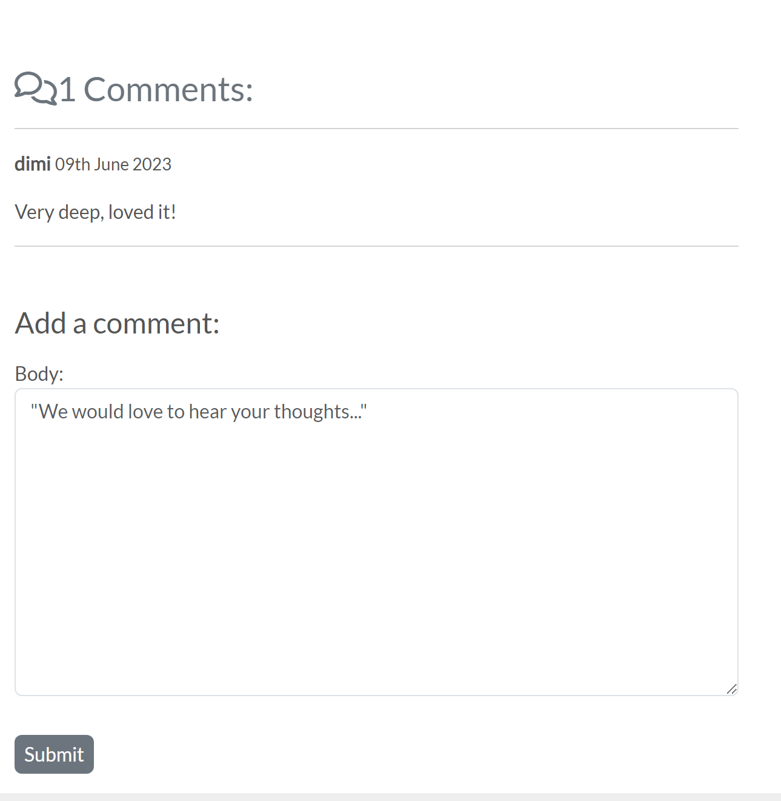

<h1 align="center"><strong>CLAY</strong>CAFE</h1>

Welcome to Clay Cafe. We are an ecommerce business specializing in handmade clay products that are as beautiful as they are unique. Explore our collection of vases, cups, plates & bowls, and discover the magic of clay artistry.

But we offer more than just products. Dive into our blog, where we share pottery tips, techniques, and inspiration. Join our on-site workshops to get hands-on experience and learn from skilled artisans and while you're here, don't forget to have a sip of our tasty roasted coffee and snacks for a complete sensory experience.

At Clay Cafe, we're passionate about fostering creativity and providing a space for art enthusiasts to connect. Join us on this clay-filled journey and uncover the wonders of handmade art at Clay Cafe.

 

**[Go to the Website](https://claycafe.herokuapp.com/)**

 

**Disclaimer:** This E-Commerce store has been created solely for educational purposes. All images used in this store are sourced from free services such as Pexels and Unsplash. Please note that the products and images showcased on this platform are not available for purchase. This project doesn't have a physical cafe, the address and workshop location mentioned in this project belong to a local pottery workshop located in Cologne, Germany.

 

### Table of Contents

- [UX](#ux)
    - [Target Audience](#target-audience)
    - [Website owner business goals](#website-owner-business-goals)
    - [User Experience](#user-experience)
        - [User Stories](#)
    - [Design](#design)
        - [Colours](#colours)
        - [Fonts](#fonts)
        - [Images](#images)
        - [Wireframes](#wireframes)
        - [Database](#database)
- [Agile](#target-audience)
- [Features](#features)
    - [Navigation Bar](#navigation-bar)
    - [Footer](#footer)
    - [Home Page](#home-page)
    - [Shop](#all-products)
    - [Category](#category)
    - [Workshops](#workshops)
    - [Blog](#blog)
    - [Contact](#contact-form)
    - [Profile](#profile)
    - [Bag](#bag)
    - [Checkout](#checkout)
- [Features Left to Implement](#features-left-to-implement)
- [Testing](#testing)
- [SEO and Marketing](#seo-and-marketing)
- [Fixed Bugs](#fixed-bugs)
- [Deployment](#deployment)
- [Credits](#credits)
- [Acknowledgments](#acknowledgements)

# UX
## Target Audience
- Pottery enthusiasts of all ages and skill levels
- Individuals looking for unique and handcrafted pottery items
- Art and craft lovers seeking a creative outlet
- People interested in learning pottery through workshops
- Blog readers interested in pottery-related articles, tips, and inspiration
## Website owner business goals
- Offer a diverse range of high-quality pottery products
- Make the buying process easy and secure
- Newsletter, targeted email marketing and special offers
- Make workshop information clear and appealing
- Create a professional and attractive website design
- Engage with customers through social media
- Engage with customers through the blog

## User Experience

### User Stories

###	EPIC: Customer Stories, general view and navigation:

1.	As a customer, I want a website with a clean and intuitive navbar to easily navigate and find the information I need quickly and efficiently.

2.	As a customer, I want to see a list of products so I can choose which ones to buy.

3.	As a customer, I want to scroll down the homepage to have a quick overview of the website’s content.

4.	As a customer, I want to see details about each product, like the price, description, and image.

5.	As a customer, I want to easily see the total amount of my purchases at any time so I can review my order before buying.

### EPIC: Allauth Registration and User account:

6.	As a user, I want to sign up for the website quickly and easily so that I can start using the full functionality of the website and enjoy a seamless user experience.

7.	As a user, I want to create a profile easily so I can save my information for purchases, delivery, and commenting on the site.

8.	As a user, I want to be able to log in and log out easily so I can access my information and make purchases without filling in forms repeatedly.

9.	As a user, I want an uncomplicated way to recover my password if I forget it so I can regain access to my account.

10.	As a user, I want to receive a confirmation email after registering to make sure my registration was successful.

11.	As a user, I want a personalized user profile where I can see my order history, confirmations, and payment/delivery information.

12.	As a user, I want to log out from the blog whenever I want so that my personal details are not visible to anyone who may use the device after me.

###	EPIC: Sorting and searching through products.

13.	As a buyer, I want to sort the list of available products based on price, and rating , so I can easily identify the products in which I am interested.

14.	As a buyer, I want to effortlessly search and browse through categorized product lists to find items that I may want to purchase.

15.	As a buyer, I want to be able to search for a product by its name or description, making it convenient for me to find a specific item I wish to buy.

16.	As a buyer, I want to see a list of search results and the number of results displayed, allowing me to quickly decide if the products are of interest to me or not.

###	EPIC: Buying and  Checkout:

17.	As a buyer, I want to easily select the product I want so that I can quickly add the desired product to my shopping bag.

18.	As a buyer, I want to see the items I have added to my shopping bag, allowing me to review the total cost of my order and verify the included items.

19.	As a buyer, I want the ability to edit the number of individual items in my shopping bag, making it easy for me to make any necessary changes before proceeding to checkout.

20.	As a buyer, I want a user-friendly process to enter my payment information, enabling me to complete the checkout process quickly and effortlessly.

21.	As a buyer, I want a secure and efficient payment method to pay for my items, ensuring the safety and confidentiality of my credit card and delivery information.

22.	As a buyer, I want to receive an order confirmation immediately after checkout, providing me with the assurance that my payment was successful, and my order is confirmed.

23.	As a buyer, I want to receive an email confirmation after checkout, serving as a reference for my order and financial details, if needed in the future.

### EPIC: Blog and Workshops

24.	As a business owner, I want to share knowledge about diverse topics of pottery and coffee through blog posts so that I can increase the audience and attract potential customers.

25.	As a business owner, I want to offer a variety of workshops to attract more people and encourage them to visit our place.

26.	As a business owner, I want to connect with customers via email so that I can easily communicate the latest updates and address any questions they may have.

### EPIC: Admin and Store Management

27. As a website owner, I want to be able to add a product so that I can include the latest items in the store.

28. As a website owner, I want to be able to edit products so that I can change product prices, images, and descriptions.

29. As a website owner, I want to be able to delete a product so that I can remove items that are no longer available for sale.
## Design

### Colours
Color Palette by [ColorHunt](https://colorhunt.co/) was used

 

### Fonts

All fonts used in this project are the default fonts from bootstrap 5.3 classes.

### Images

All images used in this e-commerce store are sourced from free services such as Pexels and Unsplash. The names of the authors of the images have not been altered, and you can find their names in the media folder. The majority of the captivating product images were provided by Tom Crew, as his images' backgrounds align with the color scheme of this store.

### Wireframes

- Navbar, Home page and footer.(Larger screens left | smaller screens right)

 

- Product Details View

 

- Bag and Workshop Wireframes

 

- Checkout and Contact

 

- Inspirations from diverse E-commerce stores. (Example)

 

### Database
walktrought databases and custom models 

%20(2).png)

# Agile Methodology

* Base- Sprint 1 - 16/05/2023 - 20/05/2023 (Finished at ??/05/2023)

  + Initial setup
    - Create base.html with footer
    - Install django
    - Create Home app
    - Create index.html, view and style
    - Install Allauth
    - Add Allauth templates to project templates
    - Create responsive navigation
    - Add to README.md file

* Product- Sprint 2 - 21/05/2023 - 25/05/2023 (Finished on 26/05/2023)

  + Add Product app
    - Set up models
    - Set up all products view
    - Set up product detail view
  + Add bag app
    - Set up add to bag
    - Set up edit bag
    - Set up remove from bag
  + Add Workshop app
    - Set up models
    - Set up view/form/template
    ( Workshop app wasn't totaly completed, but since it's a could have priority for the e-commerce project I'm happy with the progress made in one day working on it. To fully complete the desired end product the user should be able to submit a form for a given workshop and the workshop in question would appear on the main navbar workshop template. The user would be able to delete the workshop from the list.)
Add to README.md file

* Checkout- Sprint 3 - 26/05/2022 - 31/05/2023 (Finished on 31/05/2023)

  + Add Toasts
  + Add Checkout app
    - Set up models
    - Set up admin
    - Set up Signals
    - Set up templates
  + Add Stripe to project
    - Set up webhooks
  + Add Checkout form
  + Add Contact Us
   - Create HTML
   - Set up Email functionality
   - Add link to footer
  Add to README.md file

* Profile- Sprint 4 - 1/06/2022 - 5/06/2023 (Finished on 3/06/2023)

    + Add Profile app
        - Set up Models
        - Set up admin
        - Set up views
        - Set up templates
    + Add Blog app
        - Set up Models
        - Set up admin
        - Set up views
        - Set up templates
 Add to README.md file

* KitchenSink- Sprint 5 - 6/06/2022 - 9/06/2023 (Finished on 09/06/2023)

    - Finish the uncomplete fuctionality from other sprints
    - Depending on the time left add could have have functionality.
    - SEO and Webmarketing
    - README/TESTING

# Features

## Navigation Bar

 

## Footer
 

## Home Page
 

 

- Cafe Menu

## Shop
 

 

- Category Page

 

- Product Details

## Workshops

 

 

- Workshop Details

 

- Workshop Reservation 

 

- Booked Workshops

## Blog

 

 

- Blog Details 

 

## Contact Form

 

## Profile

- Product Management(admin)

 

- My Profile

 

- Sign-in 

 

- Sign-up

 

- Signout

## Bag 

 

## Checkout

 

- Checkout Payments

 

- Checkout Success

# Testing

Click [**here**](TESTING.md) to go to the testing.

# SEO and Marketing

Click [**here**](MARKETING.md) to go to the SEO and Marketing strategies.

# Credits

#### Color gradient for the product category buttons:

Color Palette by [ColorHunt](https://colorhunt.co/)

https://colorate.azurewebsites.net/

https://chat.openai.com/ - Was only used to pre-fill products, workshop, and blog content with text. Title and descriptions were generated by AI.

Navbar adapted from: https://demit-sb.herokuapp.com/ 
/* When the user scrolls down, hide the navbar. When the user scrolls up, show the navbar */

Cohort facilitator's Kay Welfare project: https://chirpy-chooks.herokuapp.com/ , helped me to structurize the manual testing in a more complete way.

