# Testing

## Table of contents:

- [Validator Testing](#validator-testing)
    - [Lighthouse](#lighthouse)
    - [W3C](#w3c-html)
    - [Jigsaw](#jigsaw-css)
    - [JS Validation](#js-validation)
    - [Pep8 Validation](#pep8-validation)
- [Responsiveness](#responsiveness)
- [Manual Testing](#manual-testing)
- [Testing Aknowledgments](#testing-aknowledgments)

## Validator Testing

### Lighthouse Testing

 

- Home page lighthouse testing
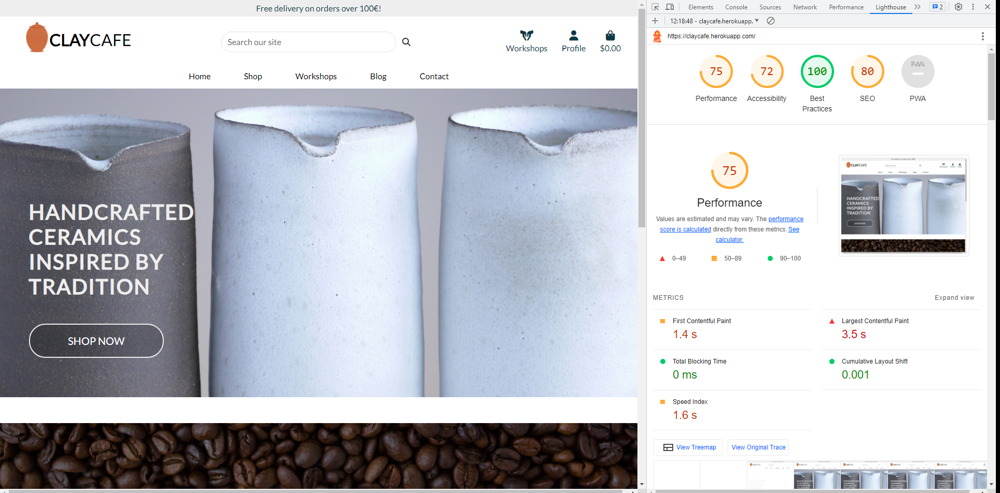

 

- Products page lighthouse testing
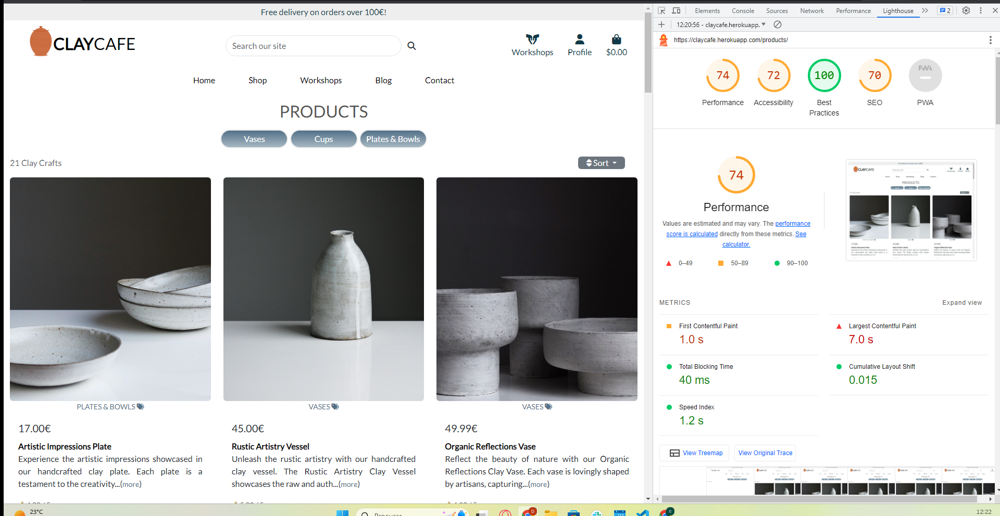

 

- Workshops page lighthouse testing
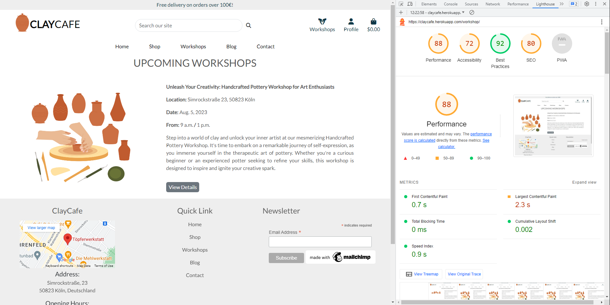

 

- Workshop Detail page lighthouse testing
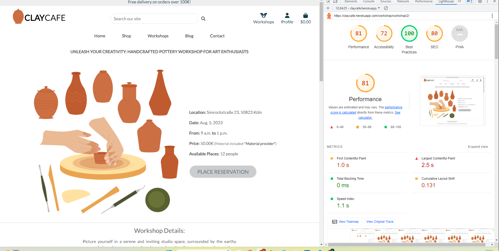

 

- Blog page lighthouse testing
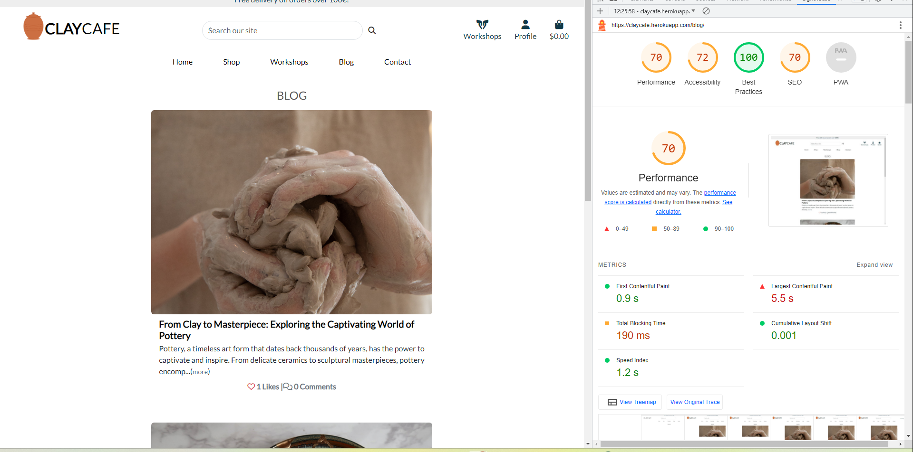

 

- Blog Detail page lighthouse testing
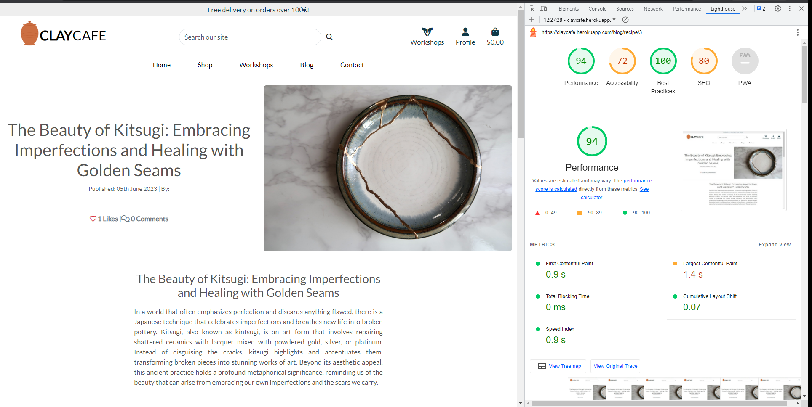

 

- Contact page lighthouse testing
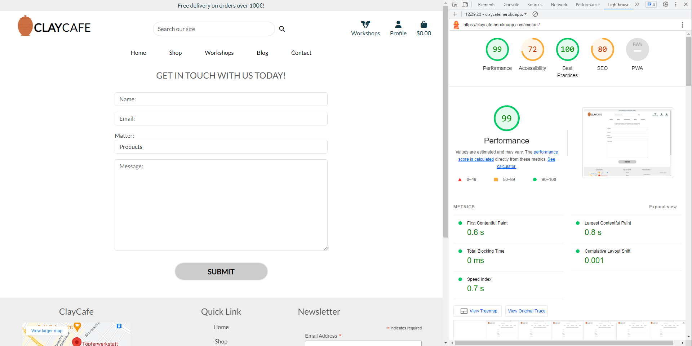

 

- Profile page lighthouse testing
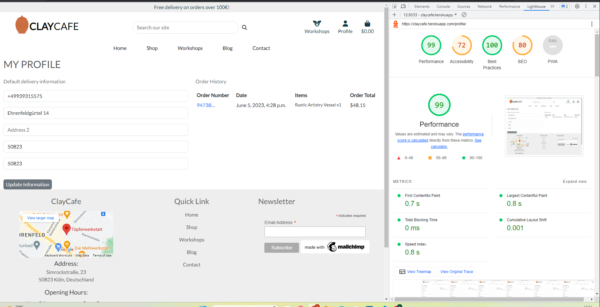

 

- Product managemant page lighthouse testing
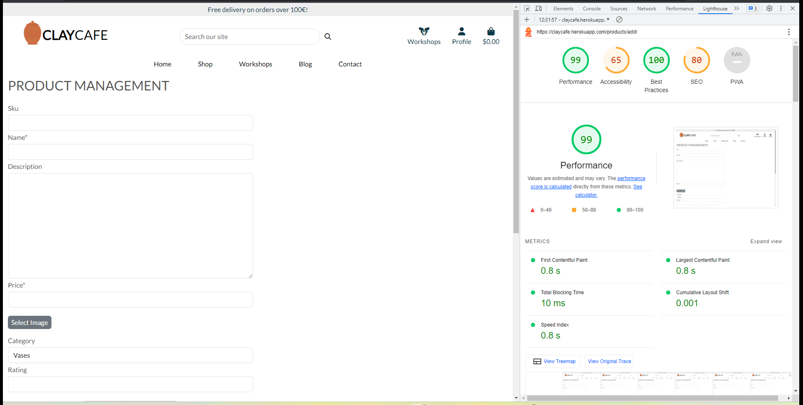

 

- Shopping bag page lighthouse testing
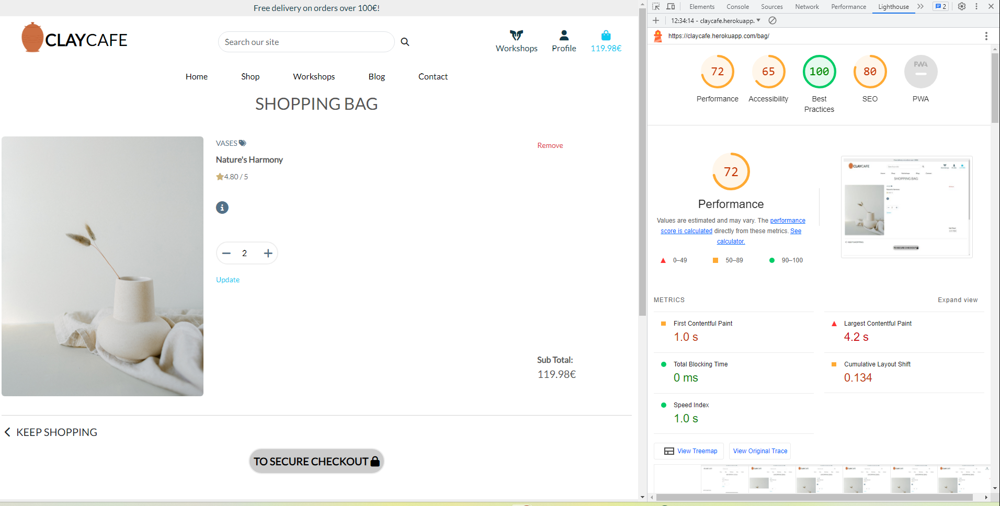

 

### W3C HTML validator
The Markup Validation Service was used to identify errors in an HTML file. Validation was performed through direct input and by using a URL.

Syntax errors were corrected, while irrelevant errors that don't affect the functioning of the website were ignored.

For example:

Errors remaining:

``Bad value ?category=Cu...``  
Error: Duplicate ID "user-options" used for dropdown menus in the navigation, derived from Bootstrap.
Errors fixed:

Error: The element "button" must not appear as a descendant of the "a" element.

### W3C Jigsaw validator
The [W3C Jigsaw CSS Validation Service](https://jigsaw.w3.org/css-validator/) was used to validate the CSS of the website. The CSS passes with 0 errors.

 

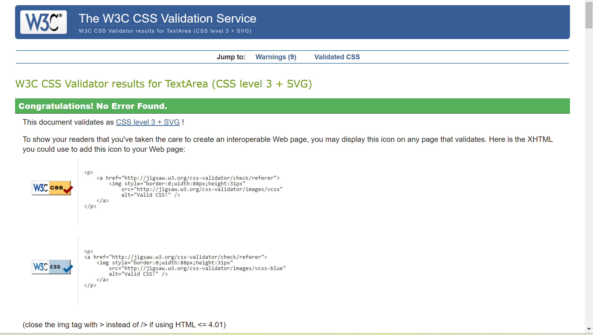

### JS Validation
To ensure the quality of the JavaScript/JQuery, I used JSHint for validation. It helps identify any potential issues or mistakes in the code. The majority of the JavaScript code in this project follows the guidelines provided in the walkthrough.
### PEP8 Validation
To verify python in this project i used the command `flake8 --statistics`

Many issues were identified and resolved during the project, such as unidentified imports and duplicates. However, to meet the project submission deadline, some of the non-critical issues like "line too-long" were left unresolved. The screenshot below provides a visual representation of the remaining issues. These issues primarily affect code readability and consistency rather than the functionality of the project.

#### Before

##### After
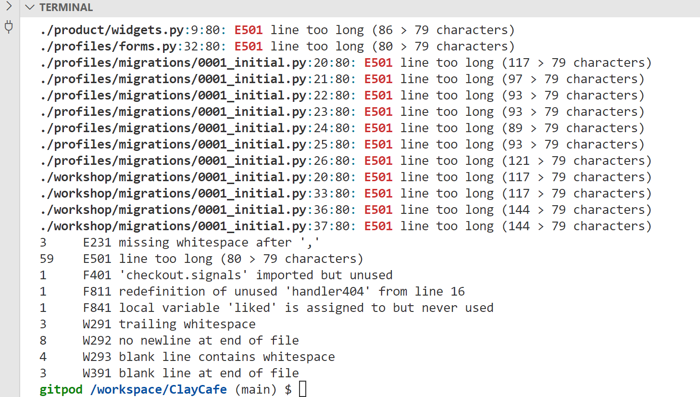

## Responsiveness

- All website pages have been designed to be responsive, ensuring they adapt to different screen sizes and devices.

- The design has been tested on multiple browsers, including Microsoft Edge, Chrome, Opera GX, and Mi(phone-Xiaomi), to ensure that it looks and functions well across different platforms.

- Bootstrap responsive classes were utilized to create a responsive design for this project.

- The design was tested using Chrome DevTools, a browser-based tool for testing and debugging responsive designs.

- Navigation has been simplified for smaller screens, with a hamburger menu replacing the desktop navigation bar, making it easier for users to navigate the site on mobile devices.

 

**Additionaly following media queries were used:**
- @media (min-width: 1200px)
- @media (min-width: 992px)
- @media (min-width: 576px) 
- @media (max-width: 576px) 

## Manual Testing

### Navbar

| Feature | Action             | Expected Result                 |
| :-----: | :-----------------:| :------------------------------:|
| **Home Link Logo** | While not on homepage, click logo. | User is redirected back to homepage. |
| **"Home" Link** | While not on homepage, click "Home". | User is redirected back to homepage. |
| **"Shop" dropdown** | Click dropdown in navbar | User is presented with a list of links (all categories, Vases, Cups, Plates &  Bowls) |
| **Product- Category** | From "Shop" dropdown, select sub-link | User is directed to page listing all products of same category |
| **"Workshop" link** | Click Workshop link in navbar | User is directed to workshop page listing all entries |
| **"Blog" link** | Click Blog link in navbar | User is directed to the blog page with all the blog posts |
| **"Contact** | Click Contact link in navbar | User is directed to Contact page with the form to send to the administrator|
| **"Search field** | Type query | User is directed to products page with the products where the keyword appears |
| **"Workshops icon" link** | Click Workshop link in navbar | User is directed to workshop page listing all user's selected entries (This function is in development, more time is needed)|
| **"Profile" dropdown** | Click Profile dropdown | Authenticated user sees option to "My Profile" and  "Logout". Admin user sees option to "Product Managment", "My Profile", and "Logout"|
| **"Login" Link** | While not authenticated, click "Login". | User is directed to Login form. |
| **"Register" Link** | While not authenticated, click "Register". | User is directed to Sign Up form. |
| **"Logout" Link** | While authenticated, click "Logout". | User is directed to page with Sign Out button. |
| **"Basket" Link** | Click Basket link in navbar | User is directed to shopping basket page. |

 

### Footer

| Feature | Action             | Expected Result                 |
| :-----: | :-----------------:| :------------------------------:|
| **"Home" Link** | While not on homepage, click "Home". | User is redirected back to homepage. |
| **"Shop" dropdown** | Click dropdown in footer | User is presented with a list of links (all categories, Vases, Cups, Plates &  Bowls) |
| **Product- Category** | From "Shop" dropdown, select sub-link | User is directed to page listing all products of same category |
| **"Workshop" link** | Click Workshop link in footer | User is directed to workshop page listing all entries |
| **"Blog" link** | Click Blog link in footer | User is directed to the blog page with all the blog posts |
| **"Contact** | Click Contact link in footer | User is directed to Contact page with the form to send to the administrator|
| **"Newsletter** | Enter valid e-mail and Click subscribe link in footer | User is presented with confirmation success mesage if email is valid|
| **"Map" link** | Click map link in footer | User is directed to the google maps page with location of the bussiness. |
| **Social media links**   | Click on any of the social media icons | A new tab opens with the respective social media site. |
| **Privacy Policy page** | Click the "Clay Cafe Privacy Policy" link in the footer | User is directed to the Privacy Policy page. The page contains a complete GDPR-compliant document outlining the privacy practices and policies of the service. |

### Authentication

| Feature | Action             | Expected Result                 |
| :-----: | :-----------------:| :------------------------------:|
| **Login**    | As an already registered user, go to the login page, complete the login form, and click the login button. | Form validation is applied to ensure the required fields are filled correctly. If the login is successful, the user is directed to the homepage, and a success message is displayed, mentioning the "username" |
| **Forgot Password function** | On the login page, click the "Forgot Password" link. | User is directed to the Reset Password page. Form validation is applied to ensure the required fields are filled correctly. A password reset link is sent to the user's email for resetting the password. |
| **Sign Up**   | As an unregistered user, go to the Sign Up page, complete the form, and submit it.  | Form validation is applied to ensure the required fields are filled correctly. After successful submission, the user receives a confirmation email containing a registration verification link. Clicking the link directs the user to the Login page. A success message informs the user about the successful account registration. |
| **Logout**    | As an authenticated user, go to the Logout page and click the "Sign out" button.   | User is directed to the homepage. A success message informs the user about the successful sign out. |

### Custom 404 page

| Feature | Action             | Expected Result                 |
| :-----: | :-----------------:| :------------------------------:|
| **Custom 404 page**      | Enter an invalid URL | The user is redirected to a personalized 404 error page. The page informs the user that the requested URL is invalid and offers a "Return Home" button. |

### Home page
**Shop Now button**

| Feature | Action                  | Expected Result                 |
| :-----: | :----------------------:| :------------------------------:|
| **Shop Now button** | Click button located on homepage | Users is directed to all products page, listing all available categories and products|

### Products 

**All Products page**

| Feature | Action                  | Expected Result                 |
| :-----: | :----------------------:| :------------------------------:|
| **Category links** | Click on any category button | User is directed to products page of respective category |
| **Sort** | Click on any sorting dropdown options | User can sort all products based on price and rating |
| **Number of products in category** | Updates the number for each category | User can sort all products based on price and rating |

 

**Product Details page**

| Feature | Action                  | Expected Result                 |
| :-----: | :----------------------:| :------------------------------:|
| **category link of the product** | Label tag icon  | User is directed back to the category page of this product's category |
| **Page content** | On products detail page | User can see product image, read product title, description, price and the rating|
| **Quantity form** | Enter different value into quantity input. | Values outside the range of 1-5 will show form validation error when adding product to basket |
| **Quantity adjustment buttons** | Adjust quantity input value with - or + button | Value will not go below 1 or above 5. Buttons become pale when reaching top or bottom range |
| **Add to bag button** | Click button | Product is added to basket with specified quantity. Basket nav link updates to show current price and success toast message shows image, title, quantity of the product |
| **Keep shopping link** | Click button | User is directed back to all products page |

 

**Product Management (admin)**

| Feature | Action                   | Result                 |
| :-----: | :-----------------:|  :---------------------:|
| **Adding products** |  Add products form allows submission of new product | Form validation prevents from submitting empty products. User is redirected to detail page of newly submitted product. Success alert displays. |
| **Editing products** | Click Edit below product image | After clicking Edit, info alert tells user that post is being edited. Form validation prevents from submitting empty products. Form submit redirects user to product detail page with updated content. Success alert displays. |
| **Deleting products** | Click Delete button. | This button delets the product without confirmation. Success message in a toast is displayed. |

### Workshops and Workshop Detail

| Feature | Action                   | Result                 |
| :-----: | :-----------------------:| :---------------------:|
| **Workshops page** | Navigate to Workshops via navlink | User sees all all workshops available |
| **Workshop Detail** | Click on workshop | User sees new page with image, title, workshop details|
| **Place Reservation button** | Click on the button | User gets scrolled down to the end of the page to fill out a form with form validation present. After submitting the users gets redirected to my workshops page, which is accessible from navbar (functionality displaying users choosen workshops, in the near future)|
| **External link** | Link on the "Material provider" | Users get redirected to the sponsors' website |

### Blog and Blog Detail

**Unauthenticated Users**

| Feature | Action                   | Result                 |
| :-----: | :-----------------------:| :---------------------:|
| **Blog page** | Navigate to Blog via navlink | User sees all all blog posts |
| **Post Detail** | Click on blog post | User sees new page with image, title, number of likes and comments, content, and approved comments below. Like button redirects to sign-in page|

**Authenticated Users**

| Feature | Action                   | Result                 |
| :-----: | :-----------------------:| :---------------------:|
| **Liking and Commenting the Post** | Liking on the heart icon and commenting under the blog post | Alert message informs user that his comment is awaiting approval |
| **View Comments** | Scroll below blog post entry | User can read approved responses by the admin |

**Admin Users (admin-CRUD)**

| Feature | Action                   | Result                 |
| :-----: | :-----------------------:| :---------------------:|
| **Add Blog Posts** | Add blog post form in admin panel | Admin Form validation.User is redirected to detail page of newly submitted entry. Success toast message displays. |
| **Editing entry** |  Click on the title of the created post. | After clicking on the title form validation prevents from entring faulty information. Success alert displays in admin panel. |
| **Deleting entry** | Delete option on each blog post detail page (admin-panel) allows admin user to delete existing post. | Admin is requested to confirm deletion of entry. "Yes, I'm sure" button deletes entry and success alert confirms action. "No, take me back" button cancels delete action. |

### Contact Page

| Feature | Action                   | Result                 |
| :-----: | :-----------------------:| :---------------------:|
| **Contact page** | Navigate to Contact page via navlink | User sees form to get in contact with the administrators of the website.Form validation is present. |
| **Submit** | clicking on submit button | When the user submits the contact form the page shows a "username" and thanks for the contact. |

### Profile (authenticated users)

| Feature | Action                  | Expected Result                 |
| :-----: | :----------------------:| :------------------------------:|
| **Profile page** | Go to Profile page trough link in navbar | User can see details |
| **Delivery information form** | Edit form and submit delivery information. | Form validation prevents from entering faulty information. Checkout page, contact info section of payment form is pre-populated with saved info from user profile, when Save this delivery checkbox is activated. |
| **Review past orders** | In order history, click order number link of any past order. | User is directed to checkout success page displaying complete details of selected order and order details.Back to profile button links back to Profile page |

### Bag

| Feature | Action                  | Expected Result                 |
| :-----: | :----------------------:| :------------------------------:|
| **Empty Basket** | Without adding items to basket, go to Basket page via navbar | Basket page displays "Basket is empty" message, with an image and keep shopping button, linking to all Products page |
| **category link of the product** | Label tag icon  | User is directed back to the category page of this product's category |
| **Basket page** | Add item(s) to basket and go to Basket page via navbar | User sees tabular view of all items in basket, incl. subtotals for all items. |
| **Info button** | Click the info icon  | User gets redirected to the specific product detail page and read more informations about the product. |
| **Quantity adjustment buttons** | Adjust quantity input value with - or + button | Value will not go below 1 or above 5. Buttons become pale when reaching top or bottom range |
| **Checkout button** | Click Go to Checkout button on basket page. | User is directed to Checkout page. |
| **Update item** | Change quantity of selected item and click Update | Success message informs user that quantity for "product name" was updated to new value. Basket now displays new value, subtotal and grand total. |
| **Remove item** | Click Remove on any item in basket. | Success message informs user that "product name" was removed from basket. Basket now displays new grand total. |
| **Keep Shopping button** | Click Keep Shopping button on basket page. | User is directed to All Products page while basket information and contents are stored. |

### Checkout

| Feature | Action                  | Expected Result                 |
| :-----: | :----------------------:| :------------------------------:|
| **Checkout page** | On Basket page, click "Go to Checkout" button. | User sees complete payment form with sections for Personal Details, Delivery Information and Payment details. Display of order summery.  |
| **Save Info to Profile** | As authenticated user, tick "Save this delivery information to my profile" checkbox and submit form. Then go to My Profile page. | Form on Profile page is pre-populated with information specified during checkout process. |
| **Unregistered users** | As unauthenticated user, go to Checkout page. | Below Contact info section, "Create account" link and "login" link show, directing back to Sign Up/Login page. |
| **Adjust Bag button** | Click Adjust bag button below form. | User is directed back to bag page where they can edit order contents. |
| **Payment** | Fill out form and click Complete Order button. | Form validation is in effect. Loading spinner displays while payment is being processed. User is directed to Checkout Success page. Success message informs user of successful order placement with order number and email address. |
| **Checkout Success page** | Complete an order and get directed to Checkout Success page. | User can view complete summery of placed order, inlcuding reference number,order date, order contents, personal info and biling info of the order. Go home button links back to the home page. |

**Stripe- Webhooks and email order confirmation**

 

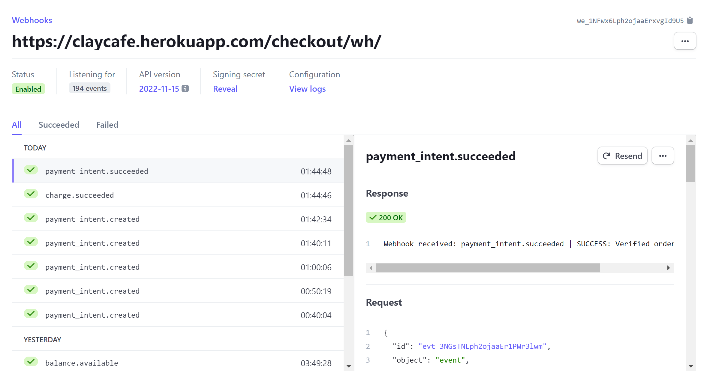

 

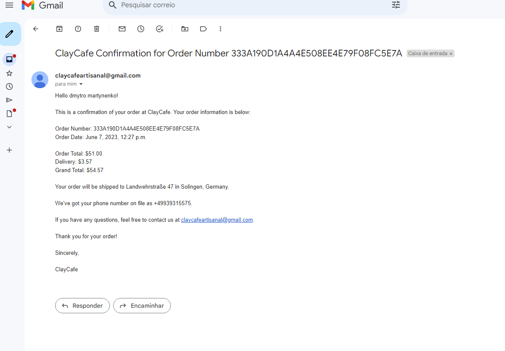

## Testing aknowledgments

During this phase, I came to the realization that for a project of this scale and with a tight deadline of approximately three weeks, I needed to adopt a different approach. I realize the importance of testing each individual app once its main functionality was implemented would have produced a better result, rather than attempting to test everything simultaneously. This approach would have prevented me from feeling overwhelmed and allowed for better testing and early error correction. Unfortunately, I only realized this now, but it has served as a valuable lesson for future projects.